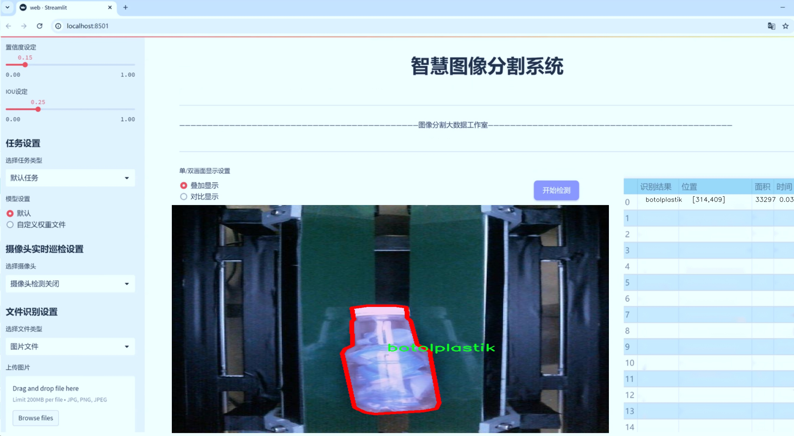
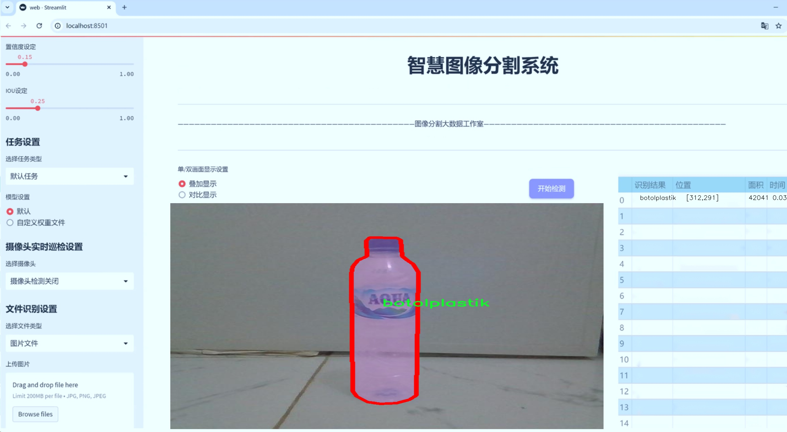
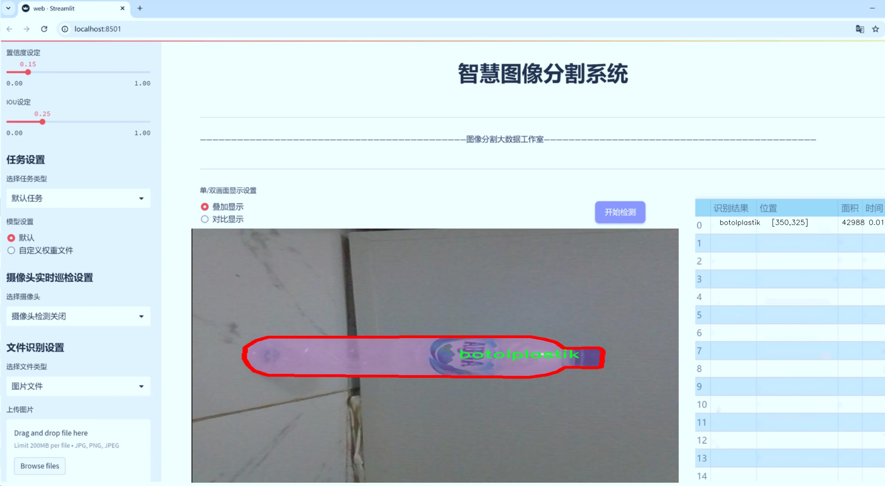
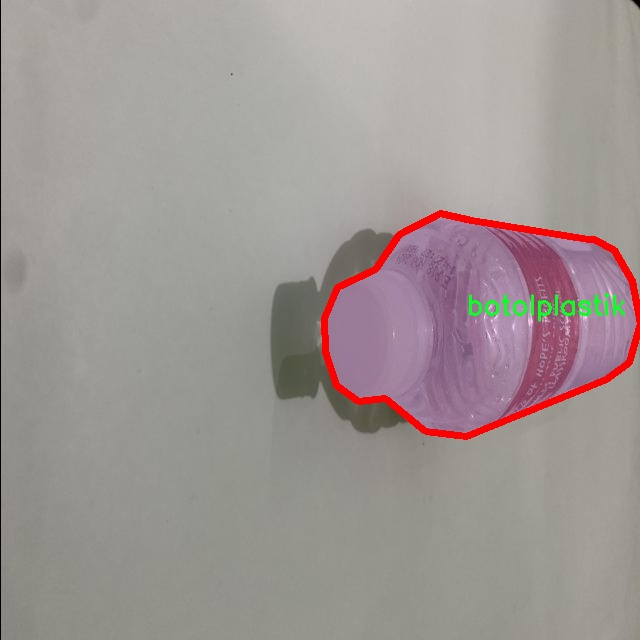
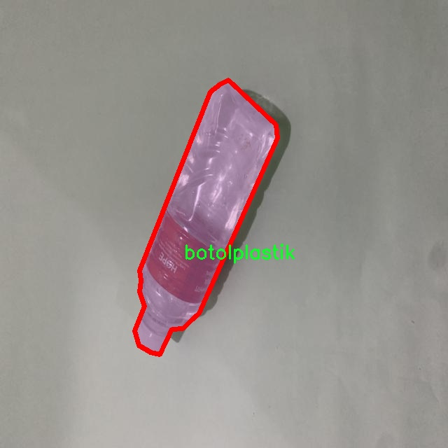
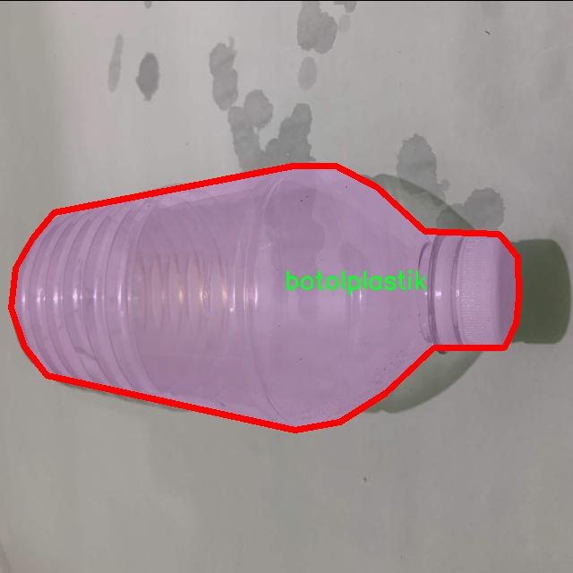
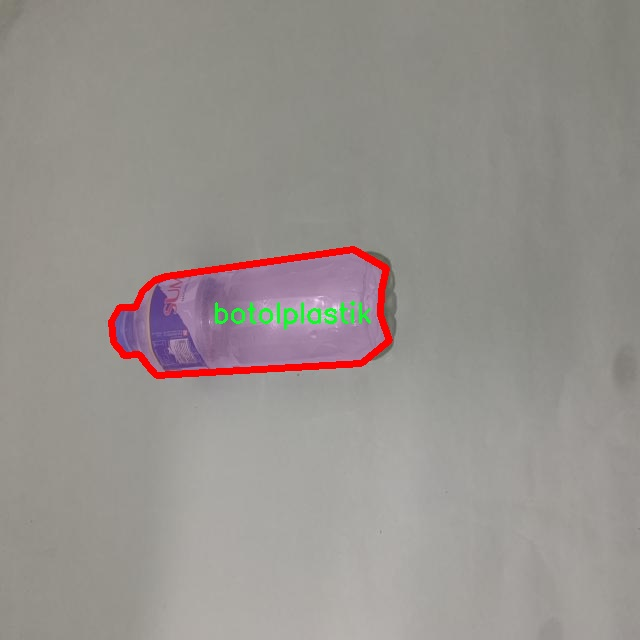
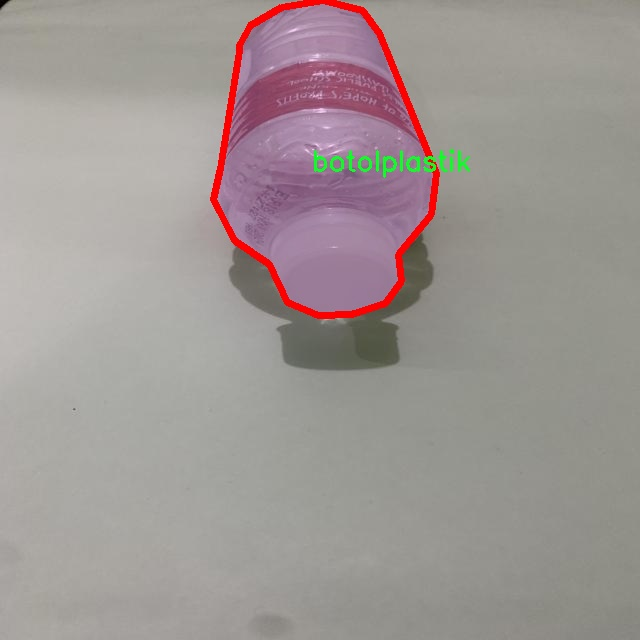

# 塑料瓶与罐的实例分割系统源码＆数据集分享
 [yolov8-seg-RevCol＆yolov8-seg-repvit等50+全套改进创新点发刊_一键训练教程_Web前端展示]

### 1.研究背景与意义

项目参考[ILSVRC ImageNet Large Scale Visual Recognition Challenge](https://gitee.com/YOLOv8_YOLOv11_Segmentation_Studio/projects)

项目来源[AAAI Global Al lnnovation Contest](https://kdocs.cn/l/cszuIiCKVNis)

研究背景与意义

随着全球塑料污染问题的日益严重，塑料瓶和罐的回收与处理成为了环境保护领域亟待解决的重要课题。根据统计数据，塑料瓶和罐的使用量逐年增加，造成了大量的塑料废弃物，这不仅对生态环境造成了严重威胁，也对人类的健康产生了潜在影响。因此，开发高效的塑料瓶与罐的自动识别与分拣系统显得尤为重要。传统的人工分拣方法不仅效率低下，而且容易受到人为因素的影响，导致分拣精度不高。基于此，利用先进的计算机视觉技术，尤其是实例分割技术，来实现对塑料瓶与罐的自动识别与分类，成为了研究的热点。

YOLO（You Only Look Once）系列模型因其在目标检测任务中的高效性和准确性而受到广泛关注。YOLOv8作为该系列的最新版本，具备了更强的特征提取能力和更快的推理速度，适合于实时应用场景。然而，YOLOv8在实例分割任务中的应用仍有提升空间，尤其是在复杂背景下对小目标的识别与分割。因此，基于改进YOLOv8的塑料瓶与罐的实例分割系统，不仅可以提高识别的准确性，还能在实际应用中实现更高的效率。

本研究使用的数据集包含1100张图像，涵盖了两类主要目标：塑料瓶（botolplastik）和罐（kaleng），以及一类非目标物体（not-botol/kaleng）。这种分类设置使得模型在训练过程中能够学习到更为丰富的特征信息，从而提高对目标物体的识别能力。此外，数据集中样本的多样性和复杂性也为模型的训练提供了良好的基础，能够有效提升模型在实际应用中的鲁棒性。

通过对YOLOv8模型的改进，研究将重点关注以下几个方面：一是优化特征提取网络，以提高对小目标的检测能力；二是引入数据增强技术，提升模型的泛化能力；三是结合后处理算法，进一步提高实例分割的精度。通过这些改进，期望能够构建一个高效、准确的塑料瓶与罐的实例分割系统，为塑料回收与处理提供技术支持。

本研究的意义不仅在于技术层面的创新，更在于其对环境保护的积极推动。通过实现对塑料瓶与罐的自动识别与分拣，能够有效提高回收效率，减少塑料废弃物对环境的影响。同时，该系统的成功应用也为其他类型废弃物的自动识别与处理提供了借鉴，推动了智能垃圾分类技术的发展。因此，本研究具有重要的理论价值和现实意义，能够为塑料污染治理提供切实可行的解决方案。

### 2.图片演示







##### 注意：由于此博客编辑较早，上面“2.图片演示”和“3.视频演示”展示的系统图片或者视频可能为老版本，新版本在老版本的基础上升级如下：（实际效果以升级的新版本为准）

  （1）适配了YOLOV8的“目标检测”模型和“实例分割”模型，通过加载相应的权重（.pt）文件即可自适应加载模型。

  （2）支持“图片识别”、“视频识别”、“摄像头实时识别”三种识别模式。

  （3）支持“图片识别”、“视频识别”、“摄像头实时识别”三种识别结果保存导出，解决手动导出（容易卡顿出现爆内存）存在的问题，识别完自动保存结果并导出到tempDir中。

  （4）支持Web前端系统中的标题、背景图等自定义修改，后面提供修改教程。

  另外本项目提供训练的数据集和训练教程,暂不提供权重文件（best.pt）,需要您按照教程进行训练后实现图片演示和Web前端界面演示的效果。

### 3.视频演示

[3.1 视频演示](https://www.bilibili.com/video/BV1562SYXETP/)

### 4.数据集信息展示

##### 4.1 本项目数据集详细数据（类别数＆类别名）

nc: 2
names: ['botolplastik', 'kaleng']


##### 4.2 本项目数据集信息介绍

数据集信息展示

在本研究中，我们采用了名为“dataset skripsi”的数据集，以训练和改进YOLOv8-seg模型，专注于塑料瓶与罐的实例分割任务。该数据集的设计旨在提供高质量的标注数据，以支持计算机视觉领域中的物体检测和分割研究。数据集包含两个主要类别，分别是“botolplastik”（塑料瓶）和“kaleng”（罐），这些类别的选择反映了在日常生活中常见的塑料和金属容器，具有广泛的应用价值。

“dataset skripsi”数据集的构建过程注重多样性和代表性，确保所收集的图像能够涵盖不同的环境、光照条件和背景。每个类别的样本均经过精心挑选和标注，以确保模型在训练过程中能够学习到丰富的特征。塑料瓶的样本包括各种形状、大小和颜色的瓶子，而罐的样本则涵盖了不同品牌和类型的金属罐。这种多样性不仅提高了模型的泛化能力，也增强了其在实际应用中的鲁棒性。

在数据集的标注过程中，采用了高精度的实例分割技术，为每个对象提供了像素级的标注。这种细致的标注方式使得YOLOv8-seg模型能够在训练过程中准确地学习到每个类别的边界和特征，从而提高分割精度。通过使用先进的标注工具，研究团队确保了数据集的标注质量，使得每个样本都能够真实反映其类别特征。

此外，数据集还考虑到了数据的平衡性。在样本数量上，塑料瓶和罐的样本数量经过合理配置，以避免模型在训练过程中出现偏倚现象。这样的设计不仅有助于提高模型的性能，还能确保在实际应用中对不同类别的检测和分割效果达到最佳。

为了进一步验证模型的性能，数据集还划分为训练集、验证集和测试集。训练集用于模型的学习，验证集用于调整模型参数，而测试集则用于最终评估模型的实际表现。这种划分方式确保了模型在不同阶段的训练和评估能够科学、系统地进行，从而提高研究的严谨性和可靠性。

总之，“dataset skripsi”作为本研究的核心数据来源，凭借其丰富的样本、多样的环境和高质量的标注，为改进YOLOv8-seg的塑料瓶与罐的实例分割系统提供了坚实的基础。通过对该数据集的深入分析和应用，我们期望能够推动物体检测与分割技术的发展，为未来的研究和实际应用提供更为有效的解决方案。











### 5.全套项目环境部署视频教程（零基础手把手教学）

[5.1 环境部署教程链接（零基础手把手教学）](https://www.bilibili.com/video/BV1jG4Ve4E9t/?vd_source=bc9aec86d164b67a7004b996143742dc)


[5.2 安装Python虚拟环境创建和依赖库安装视频教程链接（零基础手把手教学）](https://www.bilibili.com/video/BV1nA4VeYEze/?vd_source=bc9aec86d164b67a7004b996143742dc)

### 6.手把手YOLOV8-seg训练视频教程（零基础小白有手就能学会）

[6.1 手把手YOLOV8-seg训练视频教程（零基础小白有手就能学会）](https://www.bilibili.com/video/BV1cA4VeYETe/?vd_source=bc9aec86d164b67a7004b996143742dc)


按照上面的训练视频教程链接加载项目提供的数据集，运行train.py即可开始训练



     Epoch   gpu_mem       box       obj       cls    labels  img_size
     1/200     0G   0.01576   0.01955  0.007536        22      1280: 100%|██████████| 849/849 [14:42<00:00,  1.04s/it]
               Class     Images     Labels          P          R     mAP@.5 mAP@.5:.95: 100%|██████████| 213/213 [01:14<00:00,  2.87it/s]
                 all       3395      17314      0.994      0.957      0.0957      0.0843

     Epoch   gpu_mem       box       obj       cls    labels  img_size
     2/200     0G   0.01578   0.01923  0.007006        22      1280: 100%|██████████| 849/849 [14:44<00:00,  1.04s/it]
               Class     Images     Labels          P          R     mAP@.5 mAP@.5:.95: 100%|██████████| 213/213 [01:12<00:00,  2.95it/s]
                 all       3395      17314      0.996      0.956      0.0957      0.0845

     Epoch   gpu_mem       box       obj       cls    labels  img_size
     3/200     0G   0.01561    0.0191  0.006895        27      1280: 100%|██████████| 849/849 [10:56<00:00,  1.29it/s]
               Class     Images     Labels          P          R     mAP@.5 mAP@.5:.95: 100%|███████   | 187/213 [00:52<00:00,  4.04it/s]
                 all       3395      17314      0.996      0.957      0.0957      0.0845


### 7.50+种全套YOLOV8-seg创新点代码加载调参视频教程（一键加载写好的改进模型的配置文件）

[7.1 50+种全套YOLOV8-seg创新点代码加载调参视频教程（一键加载写好的改进模型的配置文件）](https://www.bilibili.com/video/BV1Hw4VePEXv/?vd_source=bc9aec86d164b67a7004b996143742dc)

### 8.YOLOV8-seg图像分割算法原理

原始YOLOV8-seg算法原理

YOLOV8-seg算法是YOLO系列目标检测算法的最新版本，代表了单阶段检测方法的进一步发展。与前几代YOLO模型相比，YOLOV8-seg在精度和速度上都进行了显著优化，特别是在处理复杂场景和小目标检测方面。该算法的核心思想是通过深度学习技术实现高效的目标检测和分割，主要由输入层、Backbone骨干网络、Neck特征融合网络和Head检测模块四个部分组成。

在输入层，YOLOV8-seg对输入图像进行预处理，包括图像缩放、Mosaic增强和灰度填充等。这些预处理步骤旨在增强数据的多样性，提升模型的泛化能力。Mosaic增强技术通过将多张图像拼接成一张图像，增加了训练样本的多样性，使得模型在面对不同场景时能够更好地适应。

Backbone部分采用了CSPDarknet结构，并引入了C2f模块来替代传统的C3模块。C2f模块的设计灵感来源于YOLOv7的ELAN思想，旨在通过引入多个分支和Bottleneck结构来增强特征提取的能力。C2f模块的核心在于通过多个分支并行处理特征，使得网络能够捕捉到更丰富的梯度流动信息，从而提高特征的表达能力。这种设计不仅保持了网络的轻量级特性，还有效地解决了深层网络中的梯度消失问题。

在特征融合方面，YOLOV8-seg采用了PAN-FPN结构。该结构通过自下而上的特征融合和自上而下的特征传递，确保了不同尺度特征之间的有效结合。具体而言，YOLOV8-seg在Neck部分对高层特征和中层特征进行上采样和拼接，从而实现了对不同层次信息的充分利用。这种多尺度特征融合的策略使得模型在处理不同大小目标时，能够保持较高的检测精度。

Head模块则采用了解耦头的结构，将分类和回归任务分开处理。这种设计的优点在于可以加速模型的收敛，同时提高了模型的检测精度。YOLOV8-seg的Head部分输出三个不同尺度的特征图，分别对应于80x80、40x40和20x20的分辨率。这些特征图经过Softmax和卷积操作后，生成最终的分类和边框回归结果。

YOLOV8-seg在损失函数的设计上也进行了创新，采用了VFLLoss作为分类损失，DFLLoss和CIoULoss作为回归损失。这种损失函数的组合不仅能够有效解决样本不平衡问题，还能提升模型对小目标的检测能力。此外，YOLOV8-seg引入了Task-Aligned Assigner策略，通过对分类和回归分数的加权匹配，进一步优化了样本匹配过程。

尽管YOLOV8-seg在许多方面进行了优化，但在复杂水面环境下，仍然面临小目标漂浮物特征复杂、背景多样等挑战。为了解决这些问题，YOLOV8-seg引入了BiFormer双层路由注意力机制，以捕获远程依赖关系，从而保留特征提取过程中的细粒度上下文信息。此外，为了提高对小目标的感知能力，YOLOV8-seg还增加了一个更小的检测头，并在Neck端引入GSConv和Slim-neck技术，以保持精度并降低计算量。

总的来说，YOLOV8-seg算法通过引入先进的网络结构和损失函数设计，显著提升了目标检测和分割的性能。其在特征提取、特征融合和任务解耦等方面的创新，使得YOLOV8-seg在复杂场景下的目标检测任务中表现出色。随着YOLO系列算法的不断发展，YOLOV8-seg无疑为目标检测领域提供了新的思路和方法，为未来的研究和应用奠定了坚实的基础。


### 9.系统功能展示（检测对象为举例，实际内容以本项目数据集为准）

图9.1.系统支持检测结果表格显示

  图9.2.系统支持置信度和IOU阈值手动调节

  图9.3.系统支持自定义加载权重文件best.pt(需要你通过步骤5中训练获得)

  图9.4.系统支持摄像头实时识别

  图9.5.系统支持图片识别

  图9.6.系统支持视频识别

  图9.7.系统支持识别结果文件自动保存

  图9.8.系统支持Excel导出检测结果数据


### 10.50+种全套YOLOV8-seg创新点原理讲解（非科班也可以轻松写刊发刊，V11版本正在科研待更新）

#### 10.1 由于篇幅限制，每个创新点的具体原理讲解就不一一展开，具体见下列网址中的创新点对应子项目的技术原理博客网址【Blog】：


[10.1 50+种全套YOLOV8-seg创新点原理讲解链接](https://gitee.com/qunmasj/good)

#### 10.2 部分改进模块原理讲解(完整的改进原理见上图和技术博客链接)【如果此小节的图加载失败可以通过CSDN或者Github搜索该博客的标题访问原始博客，原始博客图片显示正常】

### Gold-YOLO简介
YOLO再升级：华为诺亚提出Gold-YOLO，聚集-分发机制打造新SOTA
在过去的几年中，YOLO系列模型已经成为实时目标检测领域的领先方法。许多研究通过修改架构、增加数据和设计新的损失函数，将基线推向了更高的水平。然而以前的模型仍然存在信息融合问题，尽管特征金字塔网络（FPN）和路径聚合网络（PANet）已经在一定程度上缓解了这个问题。因此，本研究提出了一种先进的聚集和分发机制（GD机制），该机制通过卷积和自注意力操作实现。这种新设计的模型被称为Gold-YOLO，它提升了多尺度特征融合能力，在所有模型尺度上实现了延迟和准确性的理想平衡。此外，本文首次在YOLO系列中实现了MAE风格的预训练，使得YOLO系列模型能够从无监督预训练中受益。Gold-YOLO-N在COCO val2017数据集上实现了出色的39.9% AP，并在T4 GPU上实现了1030 FPS，超过了之前的SOTA模型YOLOv6-3.0-N，其FPS相似，但性能提升了2.4%。


#### Gold-YOLO


YOLO系列的中间层结构采用了传统的FPN结构，其中包含多个分支用于多尺度特征融合。然而，它只充分融合来自相邻级别的特征，对于其他层次的信息只能间接地进行“递归”获取。

传统的FPN结构在信息传输过程中存在丢失大量信息的问题。这是因为层之间的信息交互仅限于中间层选择的信息，未被选择的信息在传输过程中被丢弃。这种情况导致某个Level的信息只能充分辅助相邻层，而对其他全局层的帮助较弱。因此，整体上信息融合的有效性可能受到限制。
为了避免在传输过程中丢失信息，本文采用了一种新颖的“聚集和分发”机制（GD），放弃了原始的递归方法。该机制使用一个统一的模块来收集和融合所有Level的信息，并将其分发到不同的Level。通过这种方式，作者不仅避免了传统FPN结构固有的信息丢失问题，还增强了中间层的部分信息融合能力，而且并没有显著增加延迟。


# 8.低阶聚合和分发分支 Low-stage gather-and-distribute branch
从主干网络中选择输出的B2、B3、B4、B5特征进行融合，以获取保留小目标信息的高分辨率特征。


低阶特征对齐模块 (Low-stage feature alignment module)： 在低阶特征对齐模块（Low-FAM）中，采用平均池化（AvgPool）操作对输入特征进行下采样，以实现统一的大小。通过将特征调整为组中最小的特征大小（ R B 4 = 1 / 4 R ） （R_{B4} = 1/4R）（R 
B4 =1/4R），我们得到对齐后的特征F a l i g n F_{align}F align 。低阶特征对齐技术确保了信息的高效聚合，同时通过变换器模块来最小化后续处理的计算复杂性。其中选择 R B 4 R_{B4}R B4 作为特征对齐的目标大小主要基于保留更多的低层信息的同时不会带来较大的计算延迟。
低阶信息融合模块(Low-stage information fusion module)： 低阶信息融合模块（Low-IFM）设计包括多层重新参数化卷积块（RepBlock）和分裂操作。具体而言，RepBlock以F a l i g n ( c h a n n e l = s u m ( C B 2 ， C B 3 ， C B 4 ， C B 5 ) ) F_{align} (channel= sum(C_{B2}，C_{B3}，C_{B4}，C_{B5}))F align (channel=sum(C B2 ，C B3 ，C B4 ，C B5 )作为输入，并生成F f u s e ( c h a n n e l = C B 4 + C B 5 ) F_{fuse} (channel= C_{B4} + C_{B5})F fuse (channel=C B4 +C B5 )。其中中间通道是一个可调整的值（例如256），以适应不同的模型大小。由RepBlock生成的特征随后在通道维度上分裂为F i n j P 3 Finj_P3Finj P 3和F i n j P 4 Finj_P4Finj P 4，然后与不同级别的特征进行融合。


# 8.高阶聚合和分发分支 High-stage gather-and-distribute branch
高级全局特征对齐模块（High-GD）将由低级全局特征对齐模块（Low-GD）生成的特征{P3, P4, P5}进行融合。


高级特征对齐模块(High-stage feature alignment module)： High-FAM由avgpool组成，用于将输入特征的维度减小到统一的尺寸。具体而言，当输入特征的尺寸为{R P 3 R_{P3}R P3 , R P 4 R_{P4}R P4 , R P 5 R_{P 5}R P5 }时，avgpool将特征尺寸减小到该特征组中最小的尺寸（R P 5 R_{P5}R P5  = 1/8R）。由于transformer模块提取了高层次的信息，池化操作有助于信息聚合，同时降低了transformer模块后续步骤的计算需求。

Transformer融合模块由多个堆叠的transformer组成，transformer块的数量为L。每个transformer块包括一个多头注意力块、一个前馈网络（FFN）和残差连接。采用与LeViT相同的设置来配置多头注意力块，使用16个通道作为键K和查询Q的头维度，32个通道作为值V的头维度。为了加速推理过程，将层归一化操作替换为批归一化，并将所有的GELU激活函数替换为ReLU。为了增强变换器块的局部连接，在两个1x1卷积层之间添加了一个深度卷积层。同时，将FFN的扩展因子设置为2，以在速度和计算成本之间取得平衡。

信息注入模块(Information injection module)： 高级全局特征对齐模块（High-GD）中的信息注入模块与低级全局特征对齐模块（Low-GD）中的相同。在高级阶段，局部特征（Flocal）等于Pi，因此公式如下所示：


### 增强的跨层信息流动 Enhanced cross-layer information flow
为了进一步提升性能，从YOLOv8 中的PAFPN模块中得到启发，引入了Inject-LAF模块。该模块是注入模块的增强版，包括了一个轻量级相邻层融合（LAF）模块，该模块被添加到注入模块的输入位置。为了在速度和准确性之间取得平衡，设计了两个LAF模型：LAF低级模型和LAF高级模型，分别用于低级注入（合并相邻两层的特征）和高级注入（合并相邻一层的特征）。它们的结构如图5(b)所示。为了确保来自不同层级的特征图与目标大小对齐，在实现中的两个LAF模型仅使用了三个操作符：双线性插值（上采样过小的特征）、平均池化（下采样过大的特征）和1x1卷积（调整与目标通道不同的特征）。模型中的LAF模块与信息注入模块的结合有效地平衡了准确性和速度之间的关系。通过使用简化的操作，能够增加不同层级之间的信息流路径数量，从而提高性能而不显著增加延迟。


### 11.项目核心源码讲解（再也不用担心看不懂代码逻辑）

#### 11.1 ultralytics\models\rtdetr\predict.py

以下是经过简化和注释的核心代码部分，保留了RTDETR预测器的主要功能，并对每个方法进行了详细的中文注释：

```python
import torch
from ultralytics.data.augment import LetterBox
from ultralytics.engine.predictor import BasePredictor
from ultralytics.engine.results import Results
from ultralytics.utils import ops

class RTDETRPredictor(BasePredictor):
    """
    RT-DETR (实时检测变换器) 预测器，扩展自 BasePredictor 类，用于使用百度的 RT-DETR 模型进行预测。
    """

    def postprocess(self, preds, img, orig_imgs):
        """
        对模型的原始预测结果进行后处理，生成边界框和置信度分数。

        参数:
            preds (torch.Tensor): 模型的原始预测结果。
            img (torch.Tensor): 处理后的输入图像。
            orig_imgs (list or torch.Tensor): 原始未处理的图像。

        返回:
            (list[Results]): 包含后处理边界框、置信度分数和类别标签的 Results 对象列表。
        """
        # 获取预测结果的维度
        nd = preds[0].shape[-1]
        # 分离边界框和分数
        bboxes, scores = preds[0].split((4, nd - 4), dim=-1)

        # 确保原始图像是 numpy 格式
        if not isinstance(orig_imgs, list):
            orig_imgs = ops.convert_torch2numpy_batch(orig_imgs)

        results = []
        for i, bbox in enumerate(bboxes):  # 遍历每个边界框
            bbox = ops.xywh2xyxy(bbox)  # 将中心点坐标转换为左上角和右下角坐标
            score, cls = scores[i].max(-1, keepdim=True)  # 获取最大分数和对应的类别
            idx = score.squeeze(-1) > self.args.conf  # 根据置信度阈值进行筛选
            if self.args.classes is not None:
                # 如果指定了类别，进一步筛选
                idx = (cls == torch.tensor(self.args.classes, device=cls.device)).any(1) & idx
            # 合并边界框、分数和类别，并根据索引进行过滤
            pred = torch.cat([bbox, score, cls], dim=-1)[idx]
            orig_img = orig_imgs[i]  # 获取原始图像
            oh, ow = orig_img.shape[:2]  # 获取原始图像的高度和宽度
            pred[..., [0, 2]] *= ow  # 将边界框坐标转换为原始图像的尺度
            pred[..., [1, 3]] *= oh
            img_path = self.batch[0][i]  # 获取图像路径
            results.append(Results(orig_img, path=img_path, names=self.model.names, boxes=pred))  # 存储结果
        return results

    def pre_transform(self, im):
        """
        在将输入图像输入模型进行推理之前，对其进行预处理。输入图像被调整为正方形的纵横比并填充。

        参数:
            im (list[np.ndarray] | torch.Tensor): 输入图像，形状为 (N,3,h,w) 的张量，或 [(h,w,3) x N] 的列表。

        返回:
            (list): 预处理后的图像列表，准备进行模型推理。
        """
        letterbox = LetterBox(self.imgsz, auto=False, scaleFill=True)  # 创建 LetterBox 对象
        return [letterbox(image=x) for x in im]  # 对每个图像进行预处理
```

### 代码核心部分说明：
1. **RTDETRPredictor 类**：继承自 `BasePredictor`，用于实现 RT-DETR 模型的预测功能。
2. **postprocess 方法**：对模型的预测结果进行后处理，生成最终的边界框、置信度和类别标签。
3. **pre_transform 方法**：对输入图像进行预处理，确保输入符合模型要求的格式和尺寸。

这个文件是Ultralytics YOLO框架中的一个预测模块，专门用于实现RT-DETR（实时检测变换器）模型的预测功能。RT-DETR模型结合了视觉变换器的优势，能够在保持高精度的同时实现实时目标检测。该类继承自BasePredictor类，提供了一些关键特性，如高效的混合编码和IoU（交并比）感知的查询选择。

在这个模块中，主要包含两个重要的方法：`postprocess`和`pre_transform`。`postprocess`方法用于对模型的原始预测结果进行后处理，生成边界框和置信度分数。它首先将模型的输出分割为边界框和分数，然后根据设定的置信度阈值和类别过滤掉不符合条件的检测结果。最后，它将处理后的结果与原始图像结合，返回一个包含边界框、置信度和类别标签的结果列表。

`pre_transform`方法则负责在将输入图像送入模型进行推理之前对其进行预处理。它使用LetterBox技术将输入图像调整为正方形，以确保适合模型的输入要求。该方法接受一组图像，并返回经过处理的图像列表，准备好进行模型推理。

此外，类中还定义了一些属性，例如`imgsz`表示推理时图像的大小，`args`则用于存储预测器的参数覆盖设置。整个模块的设计旨在简化RT-DETR模型的使用，使用户能够方便地进行目标检测任务。

#### 11.2 ultralytics\utils\callbacks\__init__.py

```python
# 导入Ultralytics YOLO库的基础模块
# 该模块包含了一些用于集成回调和默认回调的函数

# 从base模块中导入以下函数：
# add_integration_callbacks：用于添加集成回调的函数
# default_callbacks：默认回调的集合
# get_default_callbacks：获取默认回调的函数
from .base import add_integration_callbacks, default_callbacks, get_default_callbacks

# 定义模块的公开接口
# __all__变量用于指定当使用from module import *时，哪些名称是可以被导入的
__all__ = 'add_integration_callbacks', 'default_callbacks', 'get_default_callbacks'
``` 

### 代码核心部分说明：
1. **导入模块**：代码从`base`模块中导入了三个重要的函数，这些函数在YOLO模型的回调机制中起着关键作用。
2. **公开接口**：通过定义`__all__`，指定了哪些函数可以被外部模块访问，这有助于控制模块的可用性和封装性。

这个程序文件是Ultralytics YOLO项目中的一个模块，主要用于处理回调函数的相关功能。文件的开头包含了一个版权声明，表明该代码遵循AGPL-3.0许可证。接下来，文件通过相对导入的方式引入了三个函数：`add_integration_callbacks`、`default_callbacks`和`get_default_callbacks`，这些函数可能用于在训练或推理过程中添加和管理回调函数。

在Python中，`__all__`变量用于定义当使用`from module import *`语句时，哪些名称会被导入。在这个文件中，`__all__`被设置为包含上述三个函数的元组，这意味着如果其他模块使用通配符导入这个模块，只有这三个函数会被导入。

总的来说，这个文件的主要作用是为Ultralytics YOLO框架提供回调函数的集成和管理功能，确保在使用该框架时，用户能够方便地使用和定制回调函数。

#### 11.3 ui.py

以下是代码中最核心的部分，并附上详细的中文注释：

```python
import sys
import subprocess

def run_script(script_path):
    """
    使用当前 Python 环境运行指定的脚本。

    Args:
        script_path (str): 要运行的脚本路径

    Returns:
        None
    """
    # 获取当前 Python 解释器的路径
    python_path = sys.executable

    # 构建运行命令，使用 streamlit 运行指定的脚本
    command = f'"{python_path}" -m streamlit run "{script_path}"'

    # 执行命令，并等待其完成
    result = subprocess.run(command, shell=True)
    
    # 检查命令执行的返回码，如果不为0则表示出错
    if result.returncode != 0:
        print("脚本运行出错。")

# 主程序入口
if __name__ == "__main__":
    # 指定要运行的脚本路径
    script_path = "web.py"  # 这里可以替换为实际的脚本路径

    # 调用函数运行指定的脚本
    run_script(script_path)
```

### 注释说明：
1. **导入模块**：
   - `sys`：用于访问与 Python 解释器紧密相关的变量和函数。
   - `subprocess`：用于创建新进程、连接到它们的输入/输出/错误管道，并获得它们的返回码。

2. **`run_script` 函数**：
   - 该函数接受一个参数 `script_path`，表示要运行的 Python 脚本的路径。
   - 使用 `sys.executable` 获取当前 Python 解释器的路径，以确保使用正确的 Python 环境来运行脚本。
   - 构建一个命令字符串，使用 `streamlit` 模块来运行指定的脚本。
   - 使用 `subprocess.run` 执行命令，并通过 `shell=True` 允许在 shell 中执行命令。
   - 检查命令的返回码，如果返回码不为0，表示脚本运行出错，并打印错误信息。

3. **主程序入口**：
   - 通过 `if __name__ == "__main__":` 确保只有在直接运行该脚本时才会执行以下代码。
   - 指定要运行的脚本路径（在这里是 `web.py`）。
   - 调用 `run_script` 函数来执行指定的脚本。

这个程序文件名为 `ui.py`，主要功能是使用当前的 Python 环境来运行一个指定的脚本，具体是一个名为 `web.py` 的文件。程序首先导入了必要的模块，包括 `sys`、`os` 和 `subprocess`，这些模块提供了与系统交互的功能。

在程序中定义了一个名为 `run_script` 的函数，该函数接受一个参数 `script_path`，这个参数是要运行的脚本的路径。函数内部首先获取当前 Python 解释器的路径，使用 `sys.executable` 来实现。接着，构建一个命令字符串，命令的格式是使用当前的 Python 解释器来运行 `streamlit` 模块，并指定要运行的脚本路径。

随后，使用 `subprocess.run` 方法来执行这个命令。`shell=True` 参数允许在 shell 中执行命令。执行完命令后，程序检查返回的状态码，如果返回码不为零，表示脚本运行出错，程序会打印出“脚本运行出错。”的提示信息。

在文件的最后部分，使用 `if __name__ == "__main__":` 语句来确保只有在直接运行该文件时才会执行后面的代码。在这个代码块中，首先调用 `abs_path` 函数来获取 `web.py` 的绝对路径，然后调用 `run_script` 函数来运行这个脚本。

总的来说，这个程序的主要作用是方便地通过当前 Python 环境来运行一个 Streamlit 应用脚本，并处理可能出现的错误。

#### 11.4 train.py

以下是代码中最核心的部分，并附上详细的中文注释：

```python
import os
import torch
import yaml
from ultralytics import YOLO  # 导入YOLO模型

if __name__ == '__main__':  # 确保该模块被直接运行时才执行以下代码
    # 设置训练参数
    workers = 1  # 数据加载的工作进程数量
    batch = 8  # 每个批次的样本数量
    device = "0" if torch.cuda.is_available() else "cpu"  # 判断是否使用GPU

    # 获取数据集配置文件的绝对路径
    data_path = abs_path(f'datasets/data/data.yaml', path_type='current')

    # 读取YAML文件，保持原有顺序
    with open(data_path, 'r') as file:
        data = yaml.load(file, Loader=yaml.FullLoader)

    # 修改数据集中训练、验证和测试集的路径
    if 'train' in data and 'val' in data and 'test' in data:
        directory_path = os.path.dirname(data_path.replace(os.sep, '/'))  # 获取目录路径
        data['train'] = directory_path + '/train'  # 更新训练集路径
        data['val'] = directory_path + '/val'      # 更新验证集路径
        data['test'] = directory_path + '/test'    # 更新测试集路径

        # 将修改后的数据写回YAML文件
        with open(data_path, 'w') as file:
            yaml.safe_dump(data, file, sort_keys=False)

    # 加载YOLO模型配置和预训练权重
    model = YOLO(r"C:\codeseg\codenew\50+种YOLOv8算法改进源码大全和调试加载训练教程（非必要）\改进YOLOv8模型配置文件\yolov8-seg-C2f-Faster.yaml").load("./weights/yolov8s-seg.pt")

    # 开始训练模型
    results = model.train(
        data=data_path,  # 指定训练数据的配置文件路径
        device=device,  # 指定使用的设备（GPU或CPU）
        workers=workers,  # 指定数据加载的工作进程数量
        imgsz=640,  # 指定输入图像的大小为640x640
        epochs=100,  # 指定训练的轮数为100
        batch=batch,  # 指定每个批次的样本数量
    )
```

### 代码核心部分说明：
1. **参数设置**：设置了数据加载的工作进程数量、批次大小和设备（GPU或CPU）。
2. **数据集路径处理**：读取YAML文件，更新训练、验证和测试集的路径，并将修改后的内容写回文件。
3. **模型加载**：加载YOLO模型的配置文件和预训练权重。
4. **模型训练**：调用`model.train()`方法开始训练，传入必要的参数如数据路径、设备、工作进程数量、图像大小、训练轮数和批次大小。

该程序文件`train.py`的主要功能是使用YOLO（You Only Look Once）模型进行目标检测的训练。程序首先导入所需的库，包括操作系统库`os`、深度学习库`torch`、YAML解析库`yaml`以及YOLO模型的实现库`ultralytics`。此外，还导入了一个用于处理路径的模块`abs_path`和`matplotlib`库，用于可视化。

在`__main__`模块中，程序首先设置了一些训练参数，包括工作进程数`workers`、批次大小`batch`、以及设备选择`device`。这里的设备选择是根据当前系统是否支持CUDA来决定使用GPU还是CPU进行训练。

接下来，程序通过`abs_path`函数获取数据集配置文件`data.yaml`的绝对路径，并将其转换为Unix风格的路径。然后，程序读取该YAML文件的内容，并检查其中是否包含`train`、`val`和`test`字段。如果存在这些字段，程序会将它们的路径修改为相对于数据集目录的路径，并将修改后的内容写回到YAML文件中。

程序还包含了一些注释，提醒用户不同模型的大小和设备要求可能不同，如果在训练过程中遇到问题，可以尝试使用其他模型配置文件。

随后，程序加载了YOLO模型的配置文件，并指定了预训练权重文件的路径。这里使用的是一个特定的YOLOv8模型配置文件`yolov8-seg-C2f-Faster.yaml`。

最后，程序调用`model.train()`方法开始训练模型，传入训练数据的配置文件路径、设备、工作进程数、输入图像大小、训练轮数和批次大小等参数。训练过程将在指定的参数下进行，直到完成设定的轮数。

#### 11.5 ultralytics\models\sam\amg.py

以下是经过简化和注释的核心代码部分，主要保留了与边界框、掩膜处理和裁剪相关的功能：

```python
import torch
import numpy as np

def is_box_near_crop_edge(boxes: torch.Tensor,
                          crop_box: List[int],
                          orig_box: List[int],
                          atol: float = 20.0) -> torch.Tensor:
    """
    判断给定的边界框是否接近裁剪边缘。

    参数:
    - boxes: 待检查的边界框，格式为 (x0, y0, x1, y1) 的张量。
    - crop_box: 当前裁剪框的坐标 [x0, y0, x1, y1]。
    - orig_box: 原始图像的边界框坐标 [x0, y0, x1, y1]。
    - atol: 允许的绝对误差。

    返回:
    - 一个布尔张量，指示哪些边界框接近裁剪边缘。
    """
    crop_box_torch = torch.as_tensor(crop_box, dtype=torch.float, device=boxes.device)
    orig_box_torch = torch.as_tensor(orig_box, dtype=torch.float, device=boxes.device)
    boxes = uncrop_boxes_xyxy(boxes, crop_box).float()  # 将裁剪框内的边界框转换为原始坐标系
    near_crop_edge = torch.isclose(boxes, crop_box_torch[None, :], atol=atol, rtol=0)  # 检查是否接近裁剪边缘
    near_image_edge = torch.isclose(boxes, orig_box_torch[None, :], atol=atol, rtol=0)  # 检查是否接近原始图像边缘
    near_crop_edge = torch.logical_and(near_crop_edge, ~near_image_edge)  # 只保留接近裁剪边缘但不接近原始边缘的框
    return torch.any(near_crop_edge, dim=1)  # 返回是否有框接近裁剪边缘

def uncrop_boxes_xyxy(boxes: torch.Tensor, crop_box: List[int]) -> torch.Tensor:
    """
    将裁剪框内的边界框转换为原始图像坐标系。

    参数:
    - boxes: 裁剪框内的边界框，格式为 (x0, y0, x1, y1) 的张量。
    - crop_box: 当前裁剪框的坐标 [x0, y0, x1, y1]。

    返回:
    - 转换后的边界框张量。
    """
    x0, y0, _, _ = crop_box
    offset = torch.tensor([[x0, y0, x0, y0]], device=boxes.device)  # 计算偏移量
    if len(boxes.shape) == 3:  # 检查是否有通道维度
        offset = offset.unsqueeze(1)
    return boxes + offset  # 返回加上偏移量后的边界框

def batched_mask_to_box(masks: torch.Tensor) -> torch.Tensor:
    """
    计算掩膜周围的边界框，返回格式为 (x0, y0, x1, y1)。

    参数:
    - masks: 输入掩膜，格式为 CxHxW。

    返回:
    - 包围掩膜的边界框，格式为 Cx4。
    """
    if torch.numel(masks) == 0:  # 如果掩膜为空，返回全零框
        return torch.zeros(*masks.shape[:-2], 4, device=masks.device)

    shape = masks.shape
    h, w = shape[-2:]  # 获取掩膜的高度和宽度
    masks = masks.flatten(0, -3) if len(shape) > 2 else masks.unsqueeze(0)  # 规范化形状为 CxHxW

    # 计算上下边缘
    in_height, _ = torch.max(masks, dim=-1)
    in_height_coords = in_height * torch.arange(h, device=in_height.device)[None, :]
    bottom_edges, _ = torch.max(in_height_coords, dim=-1)
    in_height_coords = in_height_coords + h * (~in_height)
    top_edges, _ = torch.min(in_height_coords, dim=-1)

    # 计算左右边缘
    in_width, _ = torch.max(masks, dim=-2)
    in_width_coords = in_width * torch.arange(w, device=in_width.device)[None, :]
    right_edges, _ = torch.max(in_width_coords, dim=-1)
    in_width_coords = in_width_coords + w * (~in_width)
    left_edges, _ = torch.min(in_width_coords, dim=-1)

    # 处理空掩膜的情况
    empty_filter = (right_edges < left_edges) | (bottom_edges < top_edges)
    out = torch.stack([left_edges, top_edges, right_edges, bottom_edges], dim=-1)
    out = out * (~empty_filter).unsqueeze(-1)  # 将空框替换为 [0, 0, 0, 0]

    return out.reshape(*shape[:-2], 4) if len(shape) > 2 else out[0]  # 返回到原始形状
```

### 代码功能概述：
1. **is_box_near_crop_edge**: 检查边界框是否接近裁剪边缘。
2. **uncrop_boxes_xyxy**: 将裁剪框内的边界框转换为原始图像坐标系。
3. **batched_mask_to_box**: 计算掩膜的边界框，返回边界框的坐标。 

这些函数在处理图像裁剪和掩膜时非常重要，尤其是在目标检测和图像分割任务中。

这个程序文件是一个与Ultralytics YOLO（You Only Look Once）模型相关的Python脚本，主要用于处理图像分割和目标检测中的一些常见操作。代码中使用了PyTorch和NumPy库，涉及到张量操作、图像处理和数据生成等功能。

首先，文件定义了一些函数，用于判断边界框是否接近裁剪边缘。`is_box_near_crop_edge`函数接受边界框、裁剪框和原始框作为输入，并返回一个布尔张量，指示哪些边界框接近裁剪边缘。它通过将边界框解裁剪并与裁剪框和原始框进行比较来实现这一点。

接下来，`batch_iterator`函数用于从输入参数中生成批次数据，确保所有输入的长度相同，并根据指定的批次大小返回数据的生成器。

`calculate_stability_score`函数计算一组掩膜的稳定性得分，使用IoU（Intersection over Union）来衡量经过阈值处理后的二进制掩膜之间的重叠程度。

`build_point_grid`和`build_all_layer_point_grids`函数用于生成均匀分布的二维点网格，前者生成一个指定边长的网格，后者为不同层次生成点网格，考虑到缩放比例。

`generate_crop_boxes`函数根据输入图像的大小、层数和重叠比例生成不同大小的裁剪框。它使用了嵌套函数来计算裁剪框的尺寸，并利用`product`函数生成所有可能的裁剪框坐标。

`uncrop_boxes_xyxy`、`uncrop_points`和`uncrop_masks`函数用于将裁剪后的边界框、点和掩膜解裁剪，恢复到原始图像的坐标系中。

`remove_small_regions`函数使用OpenCV库处理掩膜，去除小的孤立区域或孔洞，返回处理后的掩膜和一个指示是否进行了修改的布尔值。

`batched_mask_to_box`函数计算给定掩膜的边界框，返回一个包含边界框坐标的张量。它处理了空掩膜的情况，并将结果调整为适当的形状。

整体来看，这个文件提供了一系列用于图像处理和分析的工具，主要应用于计算机视觉任务，尤其是在目标检测和图像分割领域。通过这些函数，用户可以有效地处理图像数据，生成裁剪框，并计算与掩膜相关的指标。

#### 11.6 ultralytics\utils\callbacks\neptune.py

以下是代码中最核心的部分，并附上详细的中文注释：

```python
# 尝试导入 neptune 库并进行初始化
try:
    assert not TESTS_RUNNING  # 确保当前不是测试运行
    assert SETTINGS['neptune'] is True  # 确保 Neptune 集成已启用
    import neptune
    from neptune.types import File

    assert hasattr(neptune, '__version__')  # 确保 neptune 库已正确安装

    run = None  # NeptuneAI 实验记录实例

except (ImportError, AssertionError):
    neptune = None  # 如果导入失败，则将 neptune 设置为 None


def _log_scalars(scalars, step=0):
    """将标量数据记录到 NeptuneAI 实验记录器中。"""
    if run:  # 如果 run 实例存在
        for k, v in scalars.items():  # 遍历标量字典
            run[k].append(value=v, step=step)  # 记录每个标量的值和步骤


def _log_images(imgs_dict, group=''):
    """将图像记录到 NeptuneAI 实验记录器中。"""
    if run:  # 如果 run 实例存在
        for k, v in imgs_dict.items():  # 遍历图像字典
            run[f'{group}/{k}'].upload(File(v))  # 上传每个图像文件


def on_pretrain_routine_start(trainer):
    """在训练例程开始之前调用的回调函数。"""
    try:
        global run  # 声明 run 为全局变量
        # 初始化 Neptune 运行实例
        run = neptune.init_run(project=trainer.args.project or 'YOLOv8', name=trainer.args.name, tags=['YOLOv8'])
        # 记录超参数配置
        run['Configuration/Hyperparameters'] = {k: '' if v is None else v for k, v in vars(trainer.args).items()}
    except Exception as e:
        LOGGER.warning(f'WARNING ⚠️ NeptuneAI 安装但未正确初始化，未记录此运行。 {e}')


def on_train_epoch_end(trainer):
    """每个训练周期结束时调用的回调函数。"""
    _log_scalars(trainer.label_loss_items(trainer.tloss, prefix='train'), trainer.epoch + 1)  # 记录训练损失
    _log_scalars(trainer.lr, trainer.epoch + 1)  # 记录学习率
    if trainer.epoch == 1:  # 如果是第一个周期
        # 记录训练过程中的图像
        _log_images({f.stem: str(f) for f in trainer.save_dir.glob('train_batch*.jpg')}, 'Mosaic')


def on_train_end(trainer):
    """训练结束时调用的回调函数。"""
    if run:  # 如果 run 实例存在
        # 记录最终结果，包括混淆矩阵和 PR 曲线
        files = [
            'results.png', 'confusion_matrix.png', 'confusion_matrix_normalized.png',
            *(f'{x}_curve.png' for x in ('F1', 'PR', 'P', 'R'))]
        files = [(trainer.save_dir / f) for f in files if (trainer.save_dir / f).exists()]  # 过滤存在的文件
        for f in files:
            _log_plot(title=f.stem, plot_path=f)  # 记录每个图表
        # 记录最终模型
        run[f'weights/{trainer.args.name or trainer.args.task}/{str(trainer.best.name)}'].upload(File(str(trainer.best)))


# 定义回调函数字典，如果 neptune 可用则添加相应的回调
callbacks = {
    'on_pretrain_routine_start': on_pretrain_routine_start,
    'on_train_epoch_end': on_train_epoch_end,
    'on_train_end': on_train_end} if neptune else {}
```

### 代码核心部分说明：
1. **Neptune 初始化**：尝试导入并初始化 Neptune 库，用于记录实验数据。
2. **记录标量和图像**：定义了 `_log_scalars` 和 `_log_images` 函数，用于将训练过程中的标量（如损失、学习率）和图像（如训练过程中的样本）记录到 Neptune。
3. **回调函数**：定义了多个回调函数，在训练的不同阶段（如开始、每个周期结束、训练结束）执行特定的记录操作，确保实验数据的完整性和可追溯性。

这个程序文件是用于集成NeptuneAI实验日志记录的回调函数，主要用于在Ultralytics YOLO模型训练过程中记录各种训练指标、图像和绘图结果。文件的开头部分引入了一些必要的库和模块，并进行了一些基本的错误处理，以确保在没有安装Neptune或未正确配置的情况下不会导致程序崩溃。

在初始化部分，程序首先检查是否正在运行测试，并确认Neptune集成是否启用。如果一切正常，它会导入Neptune库并创建一个`run`变量，用于存储NeptuneAI实验日志记录实例。

接下来的几个函数负责记录不同类型的数据到Neptune。`_log_scalars`函数用于记录标量数据，例如损失值和学习率；`_log_images`函数用于记录图像数据，通常是训练过程中生成的图像；`_log_plot`函数用于记录绘图数据，接受标题和图像路径作为参数。

文件中定义了一系列回调函数，这些函数在训练的不同阶段被调用。`on_pretrain_routine_start`函数在训练开始前被调用，负责初始化Neptune的运行实例并记录超参数配置。`on_train_epoch_end`函数在每个训练周期结束时被调用，记录训练损失和学习率，并在第一个周期结束时记录训练批次的图像。`on_fit_epoch_end`函数在每个训练和验证周期结束时被调用，记录模型的配置信息和指标。`on_val_end`函数在验证结束时被调用，记录验证集的图像。最后，`on_train_end`函数在训练结束时被调用，记录最终的结果，包括混淆矩阵和其他性能曲线，并上传最佳模型的权重。

在文件的最后部分，所有的回调函数被组织成一个字典，方便在训练过程中调用。如果Neptune未正确初始化，则该字典将为空，从而避免不必要的错误。整体而言，这个文件的主要功能是将训练过程中的重要信息记录到Neptune，以便后续分析和可视化。

### 12.系统整体结构（节选）

### 整体功能和构架概括

Ultralytics是一个基于YOLO（You Only Look Once）模型的计算机视觉框架，主要用于目标检测、图像分割和其他视觉任务。该框架的设计旨在提供高效、灵活和易于使用的工具，支持用户进行模型训练、推理和评估。整体架构由多个模块组成，每个模块负责特定的功能，包括模型定义、数据处理、训练过程管理、回调函数集成和可视化等。

以下是各个文件的功能整理表：

| 文件路径                                         | 功能描述                                                                                       |
|--------------------------------------------------|-----------------------------------------------------------------------------------------------|
| `ultralytics/models/rtdetr/predict.py`          | 实现RT-DETR模型的预测功能，包括输入图像的预处理和模型输出的后处理。                          |
| `ultralytics/utils/callbacks/__init__.py`      | 提供回调函数的集成和管理功能，允许用户在训练和推理过程中使用和定制回调。                     |
| `ui.py`                                         | 通过当前Python环境运行指定的Streamlit应用脚本，主要用于可视化和用户交互。                   |
| `train.py`                                      | 负责YOLO模型的训练过程，包括数据集配置、模型加载和训练参数设置。                          |
| `ultralytics/models/sam/amg.py`                 | 提供图像分割和目标检测的工具函数，包括边界框处理、掩膜稳定性计算和裁剪框生成等。             |
| `ultralytics/utils/callbacks/neptune.py`       | 集成NeptuneAI实验日志记录，记录训练过程中的标量、图像和绘图数据。                          |
| `ultralytics/models/yolo/pose/__init__.py`     | 初始化YOLO姿态估计模型的相关功能，通常包括模型加载和推理接口。                             |
| `ultralytics/utils/torch_utils.py`              | 提供与PyTorch相关的工具函数，例如模型参数管理、设备配置等。                                 |
| `ultralytics/trackers/track.py`                 | 实现目标跟踪功能，通常用于在视频流中追踪检测到的对象。                                     |
| `ultralytics/hub/__init__.py`                   | 提供模型的加载和管理功能，支持从Ultralytics Hub下载和使用预训练模型。                       |
| `ultralytics/models/yolo/classify/train.py`     | 负责YOLO分类模型的训练过程，类似于目标检测训练，但专注于图像分类任务。                     |
| `ultralytics/data/augment.py`                   | 提供数据增强功能，帮助提高模型的泛化能力，通过对训练数据进行随机变换和增强。               |
| `ultralytics/data/converter.py`                 | 处理数据格式转换，通常用于将数据集转换为模型所需的格式，以便进行训练和推理。               |

以上表格总结了Ultralytics框架中各个文件的主要功能，展示了其模块化设计和各个组件之间的协作关系。通过这些模块，用户可以方便地进行目标检测、图像分割和其他计算机视觉任务。

注意：由于此博客编辑较早，上面“11.项目核心源码讲解（再也不用担心看不懂代码逻辑）”中部分代码可能会优化升级，仅供参考学习，完整“训练源码”、“Web前端界面”和“50+种创新点源码”以“14.完整训练+Web前端界面+50+种创新点源码、数据集获取”的内容为准。

### 13.图片、视频、摄像头图像分割Demo(去除WebUI)代码

在这个博客小节中，我们将讨论如何在不使用WebUI的情况下，实现图像分割模型的使用。本项目代码已经优化整合，方便用户将分割功能嵌入自己的项目中。
核心功能包括图片、视频、摄像头图像的分割，ROI区域的轮廓提取、类别分类、周长计算、面积计算、圆度计算以及颜色提取等。
这些功能提供了良好的二次开发基础。

### 核心代码解读

以下是主要代码片段，我们会为每一块代码进行详细的批注解释：

```python
import random
import cv2
import numpy as np
from PIL import ImageFont, ImageDraw, Image
from hashlib import md5
from model import Web_Detector
from chinese_name_list import Label_list

# 根据名称生成颜色
def generate_color_based_on_name(name):
    ......

# 计算多边形面积
def calculate_polygon_area(points):
    return cv2.contourArea(points.astype(np.float32))

...
# 绘制中文标签
def draw_with_chinese(image, text, position, font_size=20, color=(255, 0, 0)):
    image_pil = Image.fromarray(cv2.cvtColor(image, cv2.COLOR_BGR2RGB))
    draw = ImageDraw.Draw(image_pil)
    font = ImageFont.truetype("simsun.ttc", font_size, encoding="unic")
    draw.text(position, text, font=font, fill=color)
    return cv2.cvtColor(np.array(image_pil), cv2.COLOR_RGB2BGR)

# 动态调整参数
def adjust_parameter(image_size, base_size=1000):
    max_size = max(image_size)
    return max_size / base_size

# 绘制检测结果
def draw_detections(image, info, alpha=0.2):
    name, bbox, conf, cls_id, mask = info['class_name'], info['bbox'], info['score'], info['class_id'], info['mask']
    adjust_param = adjust_parameter(image.shape[:2])
    spacing = int(20 * adjust_param)

    if mask is None:
        x1, y1, x2, y2 = bbox
        aim_frame_area = (x2 - x1) * (y2 - y1)
        cv2.rectangle(image, (x1, y1), (x2, y2), color=(0, 0, 255), thickness=int(3 * adjust_param))
        image = draw_with_chinese(image, name, (x1, y1 - int(30 * adjust_param)), font_size=int(35 * adjust_param))
        y_offset = int(50 * adjust_param)  # 类别名称上方绘制，其下方留出空间
    else:
        mask_points = np.concatenate(mask)
        aim_frame_area = calculate_polygon_area(mask_points)
        mask_color = generate_color_based_on_name(name)
        try:
            overlay = image.copy()
            cv2.fillPoly(overlay, [mask_points.astype(np.int32)], mask_color)
            image = cv2.addWeighted(overlay, 0.3, image, 0.7, 0)
            cv2.drawContours(image, [mask_points.astype(np.int32)], -1, (0, 0, 255), thickness=int(8 * adjust_param))

            # 计算面积、周长、圆度
            area = cv2.contourArea(mask_points.astype(np.int32))
            perimeter = cv2.arcLength(mask_points.astype(np.int32), True)
            ......

            # 计算色彩
            mask = np.zeros(image.shape[:2], dtype=np.uint8)
            cv2.drawContours(mask, [mask_points.astype(np.int32)], -1, 255, -1)
            color_points = cv2.findNonZero(mask)
            ......

            # 绘制类别名称
            x, y = np.min(mask_points, axis=0).astype(int)
            image = draw_with_chinese(image, name, (x, y - int(30 * adjust_param)), font_size=int(35 * adjust_param))
            y_offset = int(50 * adjust_param)

            # 绘制面积、周长、圆度和色彩值
            metrics = [("Area", area), ("Perimeter", perimeter), ("Circularity", circularity), ("Color", color_str)]
            for idx, (metric_name, metric_value) in enumerate(metrics):
                ......

    return image, aim_frame_area

# 处理每帧图像
def process_frame(model, image):
    pre_img = model.preprocess(image)
    pred = model.predict(pre_img)
    det = pred[0] if det is not None and len(det)
    if det:
        det_info = model.postprocess(pred)
        for info in det_info:
            image, _ = draw_detections(image, info)
    return image

if __name__ == "__main__":
    cls_name = Label_list
    model = Web_Detector()
    model.load_model("./weights/yolov8s-seg.pt")

    # 摄像头实时处理
    cap = cv2.VideoCapture(0)
    while cap.isOpened():
        ret, frame = cap.read()
        if not ret:
            break
        ......

    # 图片处理
    image_path = './icon/OIP.jpg'
    image = cv2.imread(image_path)
    if image is not None:
        processed_image = process_frame(model, image)
        ......

    # 视频处理
    video_path = ''  # 输入视频的路径
    cap = cv2.VideoCapture(video_path)
    while cap.isOpened():
        ret, frame = cap.read()
        ......
```


### 14.完整训练+Web前端界面+50+种创新点源码、数据集获取


# [下载链接：https://mbd.pub/o/bread/ZpyZmpxy](https://mbd.pub/o/bread/ZpyZmpxy)